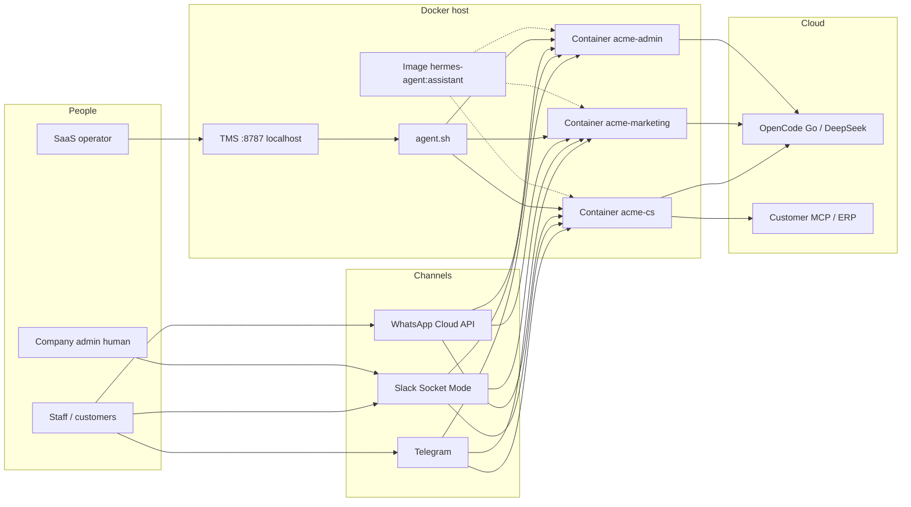
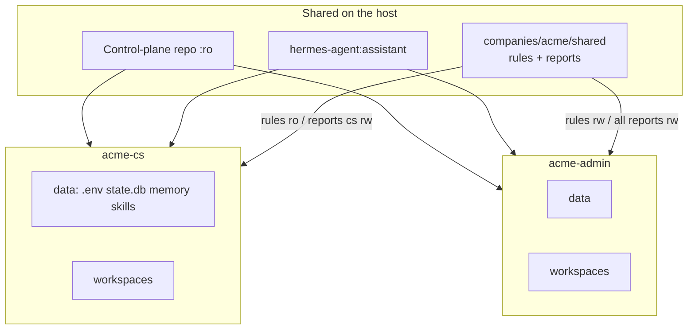
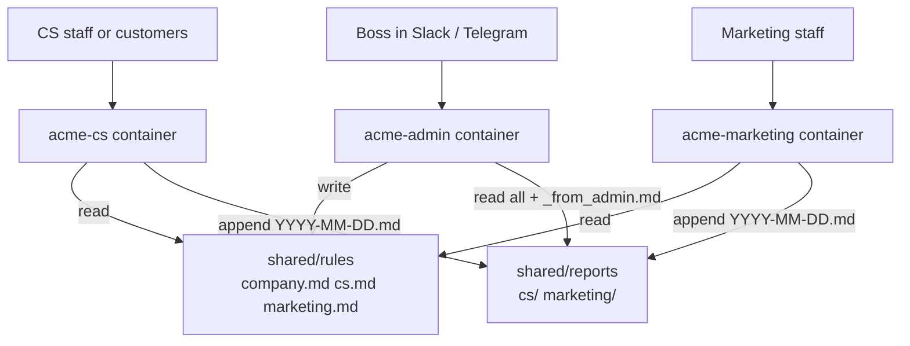
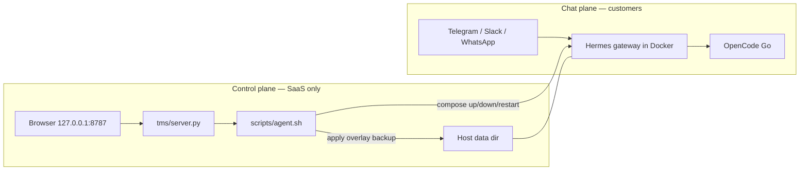

# Hermes Assistant — Architecture

One shared Docker image, many isolated bots. Models run in the cloud. The TMS is a localhost operator console — it is not in the chat path.

Related: [User guide](USER_GUIDE.md) · [TMS guide](TMS.md)

---

## 1. System context



- Each **tenant** is one container, one data dir, one bot token, one industry pack.
- One **paying client** can have several tenants (roles) under a **company**.
- LLM calls leave the host. No GPU on the box.
- Telegram and Slack are outbound-only. WhatsApp Cloud API needs a public HTTPS webhook.

---

## 2. What is isolated vs shared



| Shared | Never shared between tenants |
|---|---|
| Image, read-only repo template | `.env`, `state.db`, memories, bot token |
| Company `rules/` + `reports/` (mounted per role) | Full chat history of another role |

No `docker.sock`. Write-safe roots: `/opt/data`, `/opt/workspaces`, plus company paths when that role is mounted. Default cap: 4 GB RAM / 2 CPU / 256 PIDs.

Host root can still read volumes (normal SaaS). Stronger isolation = on-prem or one VM per customer.

---

## 3. One company, three roles



Admin plays boss: set company or department rules, read summaries. Admin **cannot** edit pack skills or reach into another container’s memory. Live “ask CS now” = human pings the CS bot, or admin leaves `reports/cs/_from_admin.md`.

Skills are added only by the SaaS team (`apply` / overlay / TMS).

---

## 4. Control plane vs chat plane



TMS does **not** sit on Telegram. It wraps `agent.sh`. It does not mount `docker.sock`. Do not give TMS to the client’s admin agent.

---

## 5. Tenant disk (what Hermes sees)

Host `~/hermes-agents/<name>/data` → container `/opt/data`.

```
data/
  .env                    secrets — never in git
  state.db memories/      private to this bot
  SOUL.md config.yaml     from pack apply
  skills/                 generated: pack + overlay
  skills-custom/          SaaS overlay — apply never wipes
  mcp.allow.custom.yaml   SaaS overlay — apply never wipes
  mcp.allow.pack.yaml     last pack allowlist
  mcp.allow.yaml          merged runtime
  .pack
```

`apply` + `overlay` write files on the host. **Restart** that container so Hermes reloads SOUL/skills. No image rebuild. Rebuild the image only when the Dockerfile / seeder / system packages change.

---

## 6. Enhance without redeploy

| Change | Rebuild image? | Recreate container? | Action |
|---|---|---|---|
| Pack skill or overlay | No | No | `apply` / `overlay`, then `restart` |
| Company rules | No | No | Admin writes markdown; next turn |
| New compose mounts | No | Yes — `up` | Same image |
| Seeder / Dockerfile | Yes (once) | Rolling `up` | Data dirs stay |

---

## 7. Backup

`agent.sh backup <name>` tars that tenant’s `data/` (excludes caches). Includes `.env`, memory, overlay.

Also back up `~/hermes-agents/companies/<co>/shared` for multi-role clients. Copy tarballs off the host. Restore: extract → `restore` → `up`. Containers are disposable; data dirs are not.

---

## 8. Hosting shapes

| Shape | When |
|---|---|
| One VPS, many tenants | Default SaaS. Root can read all volumes. |
| Customer Linux box | POS/HRMS, MCP on their LAN. |
| One VM per tenant | Banks / payroll. Same image. |
| Mac Mini | Lab only. Must never sleep. |
